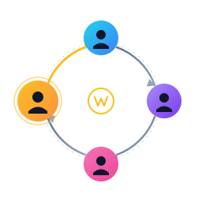

<p align="center">
  
</p>

# Weighted Random Assignment Engine

A generic weighted random assignment engine with historical penalty support, built in Rust.

## Problem

Many real-world scenarios require assigning participants to each other across multiple rounds while minimizing repeated pairings:

- **Gift exchanges**: Participants should not draw the same person every year.
- **Fair task assignment**: Distribute work fairly over time.
- **Participant matching**: Pair people for mentoring, reviews, or collaboration without repeats.
- **Scheduling with historical fairness**: Rotate assignments across multiple cycles.

This engine solves the problem by applying **penalty weights** to historical pairings, reducing the probability of repeated assignments while maintaining randomness.

## Algorithm

The engine generates **derangement** (permutations where no element maps to itself) using weighted random selection:

1. For each participant (giver), calculate weights for all possible receivers.
2. Apply a penalty based on historical frequency: `adjusted_weight = base_weight / (1 + penalty_factor * historical_count)`
3. Use weighted random selection to pick a receiver.
4. Look-ahead logic prevents dead-ends during assignment.
5. Retry with fresh shuffles if conflicts occur.

Three penalty strategies are supported:

| Strategy        | Formula                                    | Use Case                          |
|-----------------|--------------------------------------------|-----------------------------------|
| **Linear**      | `w / (1 + factor * count)`                 | Default, proportional reduction   |
| **Exponential** | `w * decay^count`                          | Strong avoidance of any repeat    |
| **Threshold**   | Full weight below threshold, reduced above | Allow some repeats, then penalize |

See [ALGORITHM.md](ALGORITHM.md) for details.

## Quick Start

### Build from source

```bash
cargo build --release
```

### Run the API server

```bash
cargo run --release --bin wra-api
```

The server starts on `http://127.0.0.1:8080` by default (override with `HOST` and `PORT` environment variables; Docker Compose sets `HOST=0.0.0.0`).

### Run the CLI tool

```bash
cargo run --release --bin wra -- generate \A
  --participants A,B,C,D \
  --penalty-factor 1.0
```

### Run with Docker

```bash
docker compose up
```

The API is available at `http://localhost:8080`.

## API Usage

### Generate Assignments

```bash
curl -X POST http://localhost:8080/assignments/generate \
  -H "Content-Type: application/json" \
  -d '{
    "participants": ["A", "B", "C", "D"],
    "history": [
      {"giver": "A", "receiver": "B", "count": 2}
    ],
    "penalty_factor": 1.0,
    "seed": 42
  }'
```

Response:

```json
{
  "assignments": [
    {"giver": "A", "receiver": "C"},
    {"giver": "B", "receiver": "D"},
    {"giver": "C", "receiver": "A"},
    {"giver": "D", "receiver": "B"}
  ]
}
```

### Health Check

```bash
curl http://localhost:8080/health
```

See [API.md](API.md) for full API documentation.

## CLI Usage

```bash
# Basic usage
wra generate --participants A,B,C,D

# With history file
wra generate \
  --participants A,B,C,D \
  --history history.json \
  --penalty-factor 2.0

# With exponential strategy
wra generate \
  --participants A,B,C,D \
  --strategy exponential \
  --decay-rate 0.5

# With deterministic seed
wra generate \
  --participants A,B,C,D \
  --seed 42
```

### History file format

```json
[
  {"giver": "A", "receiver": "B", "count": 3},
  {"giver": "B", "receiver": "C", "count": 1}
]
```

## Testing

```bash
# Run all tests
cargo test

# Run with output
cargo test -- --nocapture

# Run specific test suite
cargo test --test property_tests
cargo test --test integration_tests
```

## Project Structure

```
src/
  core/           # Domain models, algorithm, penalty strategies
  engine/         # Orchestration and validation
  api/            # REST API (axum)
  cli/            # Command-line interface (clap)
  infra/          # Configuration and logging
tests/
  property_tests.rs    # Property-based tests (proptest)
  integration_tests.rs # Full pipeline integration tests
```

See [ARCHITECTURE.md](ARCHITECTURE.md) for detailed architecture documentation.

## License

MIT
